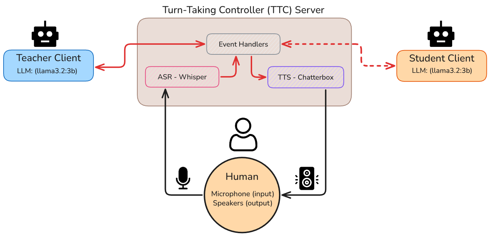

A multi-agent spoken dialogue system for educational environments. The system features a Teacher Agent and a Student Agent that interact in real-time, allowing a human learner to overhear and participate in their conversation.

**Objective**: Demonstrate how a multi-agent architecture can foster [vicarious learning](https://en.wikipedia.org/wiki/Vicarious_learning) through autonomous student-teacher interactions in a spoken triadic classroom setting. See the [full report](#Report) for details.

## Overview

This project implements a triadic classroom setting where:
- **Teacher Agent** delivers structured lessons
- **Student Agent** asks clarifying questions
- **Human Learner** participates by overhearing and contributing



## Tech Stack

- **ASR**: Whisper (OpenAI) - streaming implementation inspired by [whisper_real_time](https://github.com/davabase/whisper_real_time)
- **TTS**: Chatterbox-Turbo (ResembleAI) - streaming implementation inspired by [chatterbox-streaming](https://github.com/davidbrowne17/chatterbox-streaming)
- **LLM**: 2x Llama 3.2 (via Ollama)
- **Protocol**: TCP sockets with JSON events

## Quick Start

### Prerequisites

- Python 3.10+
- [Ollama](https://ollama.com) running locally with Llama 3.2
- Audio input/output devices

### Running the System

1. **Start the Turn-Taking Controller (TTC)**:
   ```bash
   cd src/server/turn-taking-controller
   uv run src/main.py --mode teacher_student
   ```

2. **Start the Teacher client** (in a new terminal):
   ```bash
   cd src/client/teacher
   uv run src/main.py
   ```

3. **Start the Student client** (in a new terminal):
   ```bash
   cd src/client/student
   uv run src/main.py
   ```

## Demo

[](https://youtu.be/aNFK-I0a9sY)

> [!NOTE]
> Click image to watch on YouTube:

The video shows the system running in real-time with three panels:

- **Left panel (Turn-Taking Controller)**: Shows the TTC server logging events as they occur
- **Top-right panel**: Displays what the Teacher client. 
- **Bottom-right panel**: Displays what the Student client.

## Report

The full technical report is available in the repository under `report/report.latex`, or as a PDF in [GitHub Releases](https://github.com/F21CA-Disembodied/coursework-gonzalo/releases/tag/v1.0.0).
